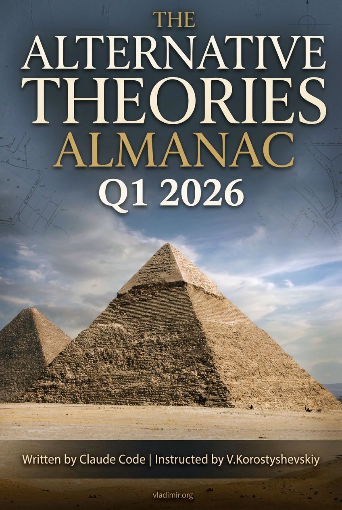

# The Alternative Theories Almanac Q1 2026

A snapshot of the alternative-theory landscape as it stood in Q1 2026: catastrophism, lost civilizations, UAPs, consciousness research, and the running argument with mainstream science about what the past actually was. 36 chapters drawn from a 1,052-source corpus across five voices in two languages.

The editorial position is this: the mainstream record is less complete than its institutional presentation implies, and the alternative framework is less supported than its advocates believe. Both statements are true at the same time. The book does not tell you which side to pick.

[Video overview of the project](https://www.youtube.com/watch?v=GkCB2OmYQjc)

## Why "Almanac"

An almanac is a dated snapshot, not a timeless reference. The corpus was assembled and the book was written in Q1 2026; both will go stale. Calling it an almanac commits to the shelf life. If the field is still active and worth re-surveying in 2027, a second edition will replace this one rather than amend it. If it is not, this volume stands as the snapshot it was meant to be. "Encyclopedia" or "compendium" would have overclaimed permanence; "almanac" is honest about the half-life.

## Why this exists

I had some free time and wanted to catch up on what was going on in the alternative-theory field. Several names, concepts, sites, and pieces of tech that came up in recent Rogan episodes were unfamiliar to me, and the fastest way to close the gap was not to watch every podcast at 1x. It was to build a corpus and run searches against it. I did this with AI's help specifically for myself, to catch up on a vast field without having to watch and read everything in it, which would have taken a lifetime. After reading what came out, I figured a handful of other people might find it useful, and put it here.

## How it was made

I used [YTubeFetch](https://github.com/vkorost/ytubefetch), my own free subtitle download app, to pull the full back catalog from three channels, preserving each video's title, description, and publication date: [**Cosmic Summit**](https://www.youtube.com/@cosmicsummit), [**Dedunking**](https://www.youtube.com/@DeDunking) (Dan Richards), and [**Antropogenez**](https://www.youtube.com/@AntropogenezRu). To these I added book text from [**Graham Hancock**](https://www.youtube.com/@grahamhancock) (English) and [**Andrey Sklyarov**](https://lah.ru/o-tsentre/sklyarov-a-yu/) (Russian), both of which I already had from another project: [Same Stones, Different Gods](https://github.com/vkorost/sklyarov-hancock-book).

The result is a corpus of roughly 8.3 million words across 1,052 sources in English and Russian:

| Source | Type | Language | Items | Words |
|--------|------|----------|-------|-------|
| Antropogenez | subtitles | Russian | 588 | ~2.9M |
| Cosmic Summit | subtitles | English | 223 | ~1.7M |
| Dedunking | subtitles | English | 199 | ~900K |
| Hancock | books | English | 10 | ~940K |
| Sklyarov | books | Russian | 32 | ~1.9M |

Eight million words is too much to read linearly. I had Claude build an MCP server that chunks the text, stores it in SQLite with FTS5 full-text indexing, and exposes search and retrieval as tools. Reference: [corpus-mcp-server.md](./corpus-mcp-server.md). I have since reused the same approach on other projects with comparable text loads.

The book itself was assembled with Claude using techniques partially described in [weekend-diy-book](https://github.com/vkorost/weekend-diy-book): style condensation, per-chapter assembly under explicit instructions, dedup, review, edit, revision, and final DOCX/PDF/EPUB generation, orchestrated as a multi-phase pipeline.

## The Five Angles

The book is organized around five voices, each occupying a distinct epistemic posture. Why these five and not others is, for the most part, my own taste:

- **Andrey Sklyarov** for the technical-measurement wing of the heterodox position. His framework is paleocontact (he calls it «цивилизация древних богов», a civilization of ancient gods), but his measurements of pre-Inca and Egyptian stonework are detailed in a way most of the field's writing is not. To my reading, he is the most technical voice from that camp.
- **Graham Hancock** because, more than any single writer, his books shaped what the lay public thinks the alternative-theory landscape even is. The field's specialists feel about him roughly the way Russian literature scholars feel about Tolstoy: complicated. To me he is the field's Tolstoy regardless.
- **Dan Richards (Dedunking)** because he is the rare voice in this space who criticizes alternative claims and academic gatekeeping with the same skepticism, and shows his sources both ways. To my reading, the most even-handed.
- **Antropogenez** as the institutional-science rebuttal, in Russian. They replicate, they do field experiments, they publish their numbers. They have an obvious editorial position; that is fine and acknowledged.
- **Cosmic Summit** as the annual gathering where citizen researchers, credentialed scientists, and catastrophists share a stage without anyone declaring the others illegitimate. The Cosmic Summit programs in the corpus are the index for which topics this book covers.

Each voice has a position and each position has limits. The book maps where the disputes are, who holds which position, and what evidence each side cites.

## Structure

36 chapters across six parts:

- **Part I: The Precision Problem** (Chs 1-6): manufacturing tolerances, drill cores, megalithic construction, geometry, geopolymers, the Giza complex.
- **Part II: The Ancient Sites** (Chs 7-15): Sphinx, Egyptian labyrinth, Göbekli Tepe, Baalbek, Tiwanaku, Gunung Padang, Easter Island, India, Mesoamerica.
- **Part III: The Drowned World** (Chs 16-21): underwater ruins, Carolina Bays, Younger Dryas, Tall el-Hammam, megafloods, flood myths.
- **Part IV: The Grand Theories** (Chs 22-27): precession, lost civilizations, Sklyarov's framework, Atlantis, ancient myths as encoded records, archaeoastronomy.
- **Part V: The Fringe** (Chs 28-33): pre-Columbian contact, Mars anomalies, UAPs, free energy, giants, elongated skulls.
- **Part VI: The Reckoning** (Chs 34-36): genetics and megafauna, the Hancock-Dibble debate and academic gatekeeping, consciousness and psychedelics.

Each chapter introduces one named concept as a cognitive handle: **The Tolerance Problem**, **The Feed Rate**, **The Black Mat**, **The Cargo Cult Inversion**, **The Allelic Profile**, and so on. These are not conclusions; they name the point where the evidence forks and the two interpretations diverge.

Chapters are self-contained and can be read in any order. `CONCEPTS.md` collects the named concepts introduced in each chapter.

## What's in this repo

- `README.md`: this file.
- `corpus-mcp-server.md`: description of the MCP approach used to make the corpus searchable during writing.
- [`book/alternative-theories-almanac-2026.pdf`](./book/alternative-theories-almanac-2026.pdf): PDF for offline reading and print.
- [`book/alternative-theories-almanac-2026.epub`](./book/alternative-theories-almanac-2026.epub): EPUB for e-readers.
- `book/chapters/`: the 36 chapters as individual Markdown files, interlinked with cross-references and endnote markers.
- `book/CONCEPTS.md`: the named concepts introduced in each chapter.
- `book/ENDNOTES.md`: sources referenced in each chapter.
- `book/BIBLIOGRAPHY.md`: full bibliography.

The raw subtitles, the third-party books in the corpus (Hancock, Sklyarov), the corpus database itself, and the implementation of the MCP server and the assembly pipeline are not published. Only the book and the description of the approach are here.

## Bilingual sourcing

Antropogenez and Sklyarov are Russian-language. The book's prose is in English. Russian appears only in direct quotes from those sources, preserved in Cyrillic with parenthetical English translation where the original wording carries rhetorical force. This is unusual for English-language work in this space; most books in the genre ignore Russian sources entirely.

## Coverage cutoff

Episodes, papers, and books published after Q1 2026 are not reflected in the corpus. The field is fluent and a lot has moved since.

## AI assistance, scope of

Claude was used for corpus search and retrieval, prose generation in a defined voice, per-chapter assembly under explicit instructions, building the MCP server, and generating the index. Editorial decisions about which positions to include were mine. I did not do any independent fact-checking or source verification beyond what is already in the corpus.

## What's not in scope

Five sources is not everyone. Bauval, Schoch (except as cited by Dedunking and Cosmic Summit), Tsoukalos, Biglino, Bibhu Dev Misra, Carlson outside his Cosmic Summit appearances, and many others are not directly sourced. Five voices, deeply represented, is more useful for this kind of survey than fifteen, shallowly summarized. If your favorite is missing, that is because I did not include them, not because I did not know about them.

## Author

I am not credentialed in archaeology, geology, genetics, or consciousness research. The book does not argue from authority. It is an organized presentation of what the people who do hold those credentials, and the people who challenge them, are actually saying.

## License

This repository is released under [Creative Commons Attribution-NonCommercial 4.0 International (CC-BY-NC-4.0)](https://creativecommons.org/licenses/by-nc/4.0/). You may read, share, quote, translate, and adapt the material with attribution for non-commercial purposes. Commercial reproduction requires permission.

---

